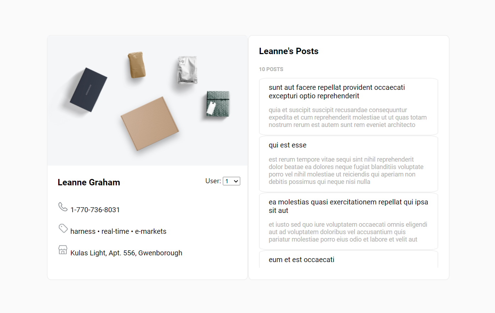

# Frontend Single Page WebApp

## Run the application

1. Clone this repository: `git clone https://github.com/neoruien/profile-page`
1. Navigate to the `profile-page` root folder and run `npm start`
1. Open [http://localhost:3000](http://localhost:3000) to view the website in the browser. The website similar to the image below should appear in a few seconds:

## Objectives achieved

1. Use React in my implementation
2. Add UI to allow us to switch between users in the list
3. Host the website for preview [[Live website link]](https://neoruien.github.io/profile-page/)

## Time spend on the assignment

I spend 1.5 days on the assignment. Most of the time was spent on integrating Axios API into the application.
